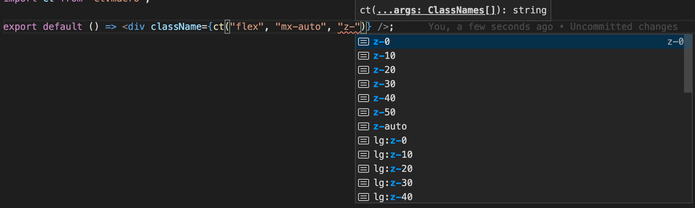
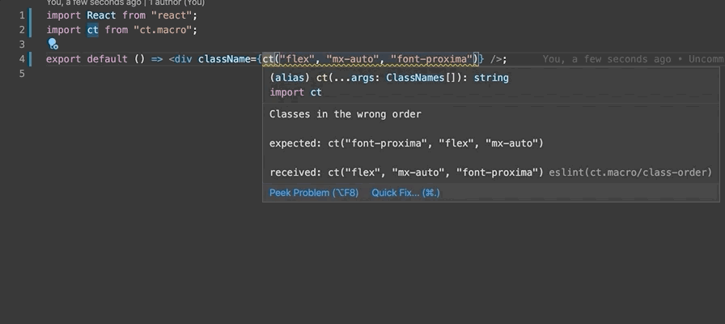

# class-types.macro

Types for your CSS classes. This is a combination of a PostCSS plugin and babel macro.

## Setup
Add this package:

with npm
```bash
npm i class-types.macro

npm i -D postcss-class-types
```
or using yarn
```bash
yarn add class-types.macro

yarn add -D postcss-class-types
```

You may need to add the babel macros plugin: https://github.com/kentcdodds/babel-plugin-macros/blob/master/other/docs/user.md Some projects such as create react app may already have this installed.

Next configure the PostCSS plugin, you'll want to add this after tailwind (or similar library), but before purgeCSS or any libraries that optimize your CSS builds.

```js
// postcss.config.js

module.exports = {
  plugins: [
    require('tailwindcss'),
    "postcss-class-types",
    require('autoprefixer'),
    ...process.env.NODE_ENV === 'production'
      ? [purgecss]
      : []
  ]
}
```

### ESLint setup
There's an optional, but nice to have eslint plugin that'll give your classes a consistent order.

Install `eslint-plugin-class-types`:
```bash
npm i -D eslint-plugin-class-types
```
```bash
yarn add eslint-plugin-class-types -D
```

Add `class-types` to the plugins section of your `.eslintrc` configuration file. You can omit the `eslint-plugin-` prefix:

```json
{
    "plugins": [
        "class-types"
    ]
}
```


Then configure the rules you want to use under the rules section.

```json
{
    "rules": {
        "class-types/class-order": 2
    }
}
```

## Usage

```jsx
import React from "react";
import ct from "class-types.macro";

export default () => <div className={ct("bg-blue-200", "flex", "mx-auto")} />;
```

The first time you compile your CSS after adding the PostCSS plugin you'll notice 2 files were generated:

`@types/class-types/classTypes.d.ts`

`@types/class-types/index.d.ts`

You can customize the path where these files are saved by passing a directory option in your postcss config.

```js
require('class-types.macro').postcss({ directory: 'custom-directory/path/' }),
```

Treat these files as you would yarn.lock or package-json.lock, commit them when you have changes, but don't edit them by hand.

## Why use this library

### TypeScript types for your tailwind classes

Confidently make changes to your tailwind config.

Ever make a change like this?
```js
// tailwind.config.js

module.exports = {
  theme: {
    extend: {
      colors: {
        blue: {
          '900': '#1e3656',
        }
      }
    }
  }
}
```
and find out later (in prod) you accidentally wiped out blue shades 100 - 800? this plugin guards against that!


### Zero runtime cost

function calls are compiled to strings via babel macro!

```jsx
// this:
<div className={ct("bg-blue-200", "flex", "mx-auto")} />

// gets compiled to this:
<div className="bg-blue-200 flex mx-auto" />
```

### Style composition without additional CSS
Tailwind provides the `@apply` directive to make using collections of classes easier. This unfortunately works against utility CSS's promise of no duplicate styles being delivered.
Class Types solves this problem by allowing users to assign groups of classes to a variable. The variables will also be assigned a union string type containing the classes so you can see what classes are in a given variable.
```js
// type: "text-green-500"
const brandColor = ct(
  "text-green-500"
);

// type: "font-medium" | "text-3xl" | "leading-tight" | "tracking-tight" | "sm:text-4xl" | "md:text-5xl" | "xl:text-4xl"
const heading = ct(
  "font-medium",
  "text-3xl",
  "leading-tight",
  "tracking-tight",
  "sm:text-4xl",
  "md:text-5xl",
  "xl:text-4xl",
);

const Page = () => {
  <main>
    <h1 className={ct(heading, brandColor, "flex")}></h1>
  </main>;
};
```

### Editor autocomplete
Never wonder again if z-index is incremented by 10 or 100!



### Auto-reorder classes via ESLint plugin/rule



### Better prettier formatting for long classes
this
```jsx
<div className="absolute overflow-x-hidden inset-x-0 w-11/12 mx-auto mt-5 overflow-y-auto bg-white outline-none border border-gray-300 border-solid rounded shadow-lg opacity-100" />
```

turns into this:

```jsx
<div
  className={ct(
    "w-11/12",
    "bg-white",
    "border-gray-300",
    "rounded",
    "border-solid",
    "border",
    "shadow-lg",
    "inset-x-0",
    "mx-auto",
    "mt-5",
    "opacity-100",
    "outline-none",
    "overflow-y-auto",
    "overflow-x-hidden",
    "absolute"
  )}
/>
```
