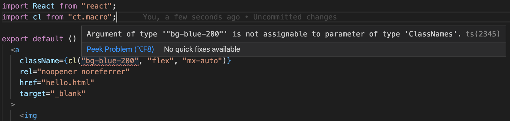

# ct.macro

Types for your CSS classes. This is a combination of a PostCSS plugin and babel macro.

## Setup
Add this package:
```bash
yarn add ct.macro
```

You may need to add the babel macros plugin: https://github.com/kentcdodds/babel-plugin-macros/blob/master/other/docs/user.md Some projects such as create react app may already have this installed.

Next configure the PostCSS plugin, you'll want to add this after tailwind (or similar library), but before purgeCSS or any libraries that optimize your CSS builds.

```js
// postcss.config.js

module.exports = {
  plugins: [
    require('tailwindcss'),

    require('ct.macro').postcss(),

    require('autoprefixer'),
    ...process.env.NODE_ENV === 'production'
      ? [purgecss]
      : []
  ]
}
```

## Usage

```jsx
import React from "react";
import ct from "ct.macro";

export default () => <div className={ct("bg-blue-200", "flex", "mx-auto")} />;
```

The first time you compile your CSS after adding the PostCSS plugin you'll notice 2 files were generated:

`@types/class-types/classnames.d.ts`

`@types/class-types/ct.macro.d.ts`

You can customize the path where these files are saved by passing a directory option in your postcss config.

```js
require('ct.macro').postcss({ directory: 'custom-directory/path/' }),
```

Treat these files as your would yarn.lock or package-json.lock, commit them when you have changes, but don't edit them by hand.

## Why use this library

### TypeScript types for your tailwind classes

Confidently make changes to your tailwind config.

Ever make a change like this?
```js
// tailwind.config.js

module.exports = {
  theme: {
    extend: {
      colors: {
        blue: {
          '900': '#1e3656',
        }
      }
    }
  }
}
```
and find out later (in prod) you accidentally wiped out blue shades 100 - 800? this plugin guards against that!



### Zero runtime cost

function calls are compiled to strings via babel macro!

```jsx
// this:
<div className={cl("bg-blue-200", "flex", "mx-auto")} />

// gets compiled to this:
<div className="bg-blue-200 flex mx-auto" />
```

### Compile time error messages for duplicate classes

```
    👋 Duplicate classes found
    
    Please use these classes:
    
    "bg-blue-200", "flex", "mx-auto"
    
    in this function: /Users/jon/Sites/my-site/Component.tsx:6:15
```

### Editor autocomplete
Never wonder again if z-index is incremented by 10 or 100!


